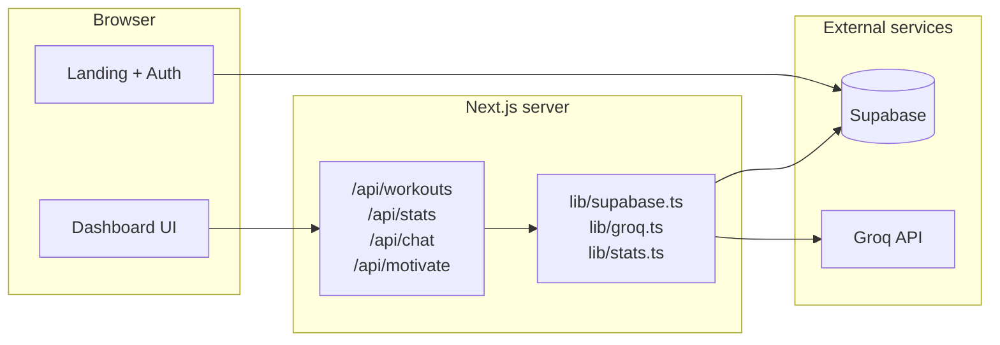

# FitCoach AI

A full-stack fitness web app: log workouts in **Supabase**, see **streaks and stats** on a **dashboard**, and get **AI motivation** plus a **chat coach** powered by **Groq** (OpenAI-compatible API). The **marketing landing** uses a WebGL **prism** background and **Supabase Auth** (email/password) for sign-in and sign-up.

---

## Features

| Area | What it does |
|------|----------------|
| **Landing (`/`)** | Hero, testimonials, rotating “live stats” carousel, Prism background, modal auth (sign in / sign up). |
| **Dashboard (`/dashboard`)** | Stats grid (streak, week count, top activity, total minutes), workout form & list, AI motivation card (tone personas), floating chat widget. |
| **Theme** | Dark / light toggle on the dashboard (UI only; persisted in React state). |
| **API** | REST-style route handlers under `app/api/*` for workouts, aggregate stats, Groq-backed chat and motivation. |

---

## Tech stack

- **Framework:** [Next.js 16](https://nextjs.org/) (App Router, React 19, Turbopack)
- **Language:** TypeScript
- **Styling:** [Tailwind CSS v4](https://tailwindcss.com/)
- **Database & auth:** [Supabase](https://supabase.com/) (`@supabase/supabase-js`)
- **AI:** [Groq](https://groq.com/) via `fetch` to the OpenAI-compatible `/v1/chat/completions` endpoint (`lib/groq.ts` — no `openai` npm package)
- **Icons:** [Lucide React](https://lucide.dev/)
- **Background:** [ogl](https://github.com/oframe/ogl) prism effect (`components/PrismBackground.tsx`)

---

## Architecture (high level)



- **Client-side Supabase** (landing auth): URL and anon key are exposed to the browser by design. The app injects them at **runtime** via `SupabasePublicConfigScript` + `lib/supabase.ts` so **Vercel** works even when `NEXT_PUBLIC_*` were not present at build time.
- **Server-side Supabase** (API routes): Same `getSupabase()` helper; uses env vars on the server.

---

## Project structure

```
fitcoach/
├── app/
│   ├── api/
│   │   ├── chat/route.ts      # Groq chat + Supabase chat_history
│   │   ├── motivate/route.ts  # Groq motivation from workout stats
│   │   ├── stats/route.ts     # JSON stats from workouts
│   │   └── workouts/route.ts  # GET/POST workouts
│   ├── dashboard/page.tsx     # Main app shell
│   ├── login/ / signup/       # Minimal routes (if linked)
│   ├── layout.tsx             # Root layout, dynamic + config script
│   ├── page.tsx               # Marketing landing
│   └── globals.css
├── components/                # UI: ChatWidget, MotivationCard, StatsGrid, etc.
├── lib/
│   ├── supabase.ts            # createClient + runtime config injection
│   ├── groq.ts                # Groq HTTP client + optional legacy helpers
│   ├── stats.ts               # Workout type + computeStats()
│   ├── chat.ts                # Chat row helpers
│   └── theme.ts
├── public/
├── package.json
└── README.md
```

---

## Prerequisites

- **Node.js** 20+ (recommended; matches `@types/node`)
- A **Supabase** project
- A **Groq** API key (for `/api/chat` and `/api/motivate`)

---

## Getting started

```bash
cd fitcoach   # directory that contains package.json
npm install
# Create .env.local in this folder — see environment variables table below
npm run dev
```

Open [http://localhost:3000](http://localhost:3000).

---

## Environment variables

Create **`.env.local`** in the same folder as `package.json` (never commit real secrets).

| Variable | Required | Description |
|----------|----------|-------------|
| `NEXT_PUBLIC_SUPABASE_URL` | Yes | Supabase project URL (`https://<ref>.supabase.co`). |
| `NEXT_PUBLIC_SUPABASE_ANON_KEY` | Yes | Supabase **anon** or **publishable** key (Settings → API). |
| `GROQ_API_KEY` | Yes* | Groq API key from [console.groq.com/keys](https://console.groq.com/keys). *Required for AI routes. |
| `GROQ_MODEL` | No | Defaults to `llama-3.3-70b-versatile`. |
| `GROQ_API_BASE` | No | Defaults to `https://api.groq.com/openai/v1`. |
| `SUPABASE_URL` / `SUPABASE_ANON_KEY` | No | Fallback names supported server-side in `lib/supabase.ts`. |
| `SUPABASE_SERVICE_ROLE_KEY` | No | Not required by this codebase as shipped; do **not** expose as `NEXT_PUBLIC_*`. |

**Vercel:** Add the same variables under **Project → Settings → Environment Variables**. Enable them for **Production** and **Preview** as needed. After changing `NEXT_PUBLIC_*`, redeploy so client bundles stay in sync; the **runtime script** in `layout.tsx` still helps the landing auth pick up server env without relying only on build-time inlining.

---

## Supabase database

The app expects two tables. Example SQL (run in **SQL Editor**); adjust types/policies to your needs:

```sql
-- Workouts logged from the dashboard
create table if not exists public.workouts (
  id uuid primary key default gen_random_uuid(),
  activity text not null,
  duration integer not null,
  date text not null,
  created_at timestamptz not null default now()
);

-- AI chat transcript (optional ordering index)
create table if not exists public.chat_history (
  id uuid primary key default gen_random_uuid(),
  role text not null,
  content text not null,
  created_at timestamptz not null default now(),
  constraint chat_history_role_check check (role in ('user', 'assistant'))
);

create index if not exists chat_history_created_at_idx
  on public.chat_history (created_at asc);
```

**Auth:** Enable **Email** provider under Authentication → Providers. The landing uses `signInWithPassword` / `signUp`.

**Security note:** The sample API routes read/write tables with the **anon** key on the server. For production you should add **Row Level Security (RLS)** policies (e.g. `auth.uid()` per user) and optionally move sensitive logic behind a **service role** only on the server. The current layout is suitable for demos and single-tenant experiments.

---

## npm scripts

| Command | Purpose |
|---------|---------|
| `npm run dev` | Next.js dev server (Turbopack). |
| `npm run build` | Production build. |
| `npm run start` | Start production server (after `build`). |
| `npm run lint` | ESLint. |

---

## API routes

| Method & path | Description |
|---------------|-------------|
| `GET /api/workouts` | List workouts, newest first (`date`, then `created_at`). |
| `POST /api/workouts` | Body: `{ activity, duration, date }` — inserts one row. |
| `GET /api/stats` | Returns computed stats JSON from all workouts. |
| `GET /api/chat` | Returns `chat_history` messages ordered by time. |
| `POST /api/chat` | Body: `{ message }` — appends user message, calls Groq, appends assistant reply. |
| `POST /api/motivate` | Body: `{ tone }` — `tough` \| `friendly` \| `nerd` \| `rival`; uses workout stats + Groq. |

Activities supported in the UI (see `ActivityIcon.tsx`): **Running, Cycling, Swimming, Gym, Yoga, Hiking, Football**.

---

## Deployment (e.g. Vercel)

1. Connect the Git repo; set **Root Directory** to the folder that contains `package.json` if the repo is nested.
2. Add **environment variables** (Supabase + Groq) for Production / Preview.
3. Deploy. Ensure `npm run build` passes locally first.

---

## Troubleshooting

| Symptom | Things to check |
|---------|------------------|
| “Missing Supabase env” | `.env.local` paths, Vercel env names, restart `next dev`, redeploy. |
| Auth works locally but not on Vercel | Same `NEXT_PUBLIC_*` on Vercel; landing uses runtime-injected config — pull latest `layout.tsx` + `SupabasePublicConfigScript`. |
| Groq / AI errors | `GROQ_API_KEY` set; model id still valid on Groq; check API route JSON error body. |
| Empty workouts / 500 from Supabase | Table names/columns match; RLS not blocking anon if you enabled it without policies. |

---

## License

Private project (`"private": true` in `package.json`). Add a license file if you open-source it.
